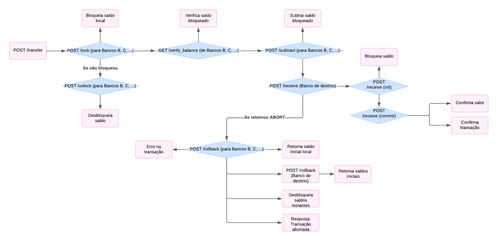
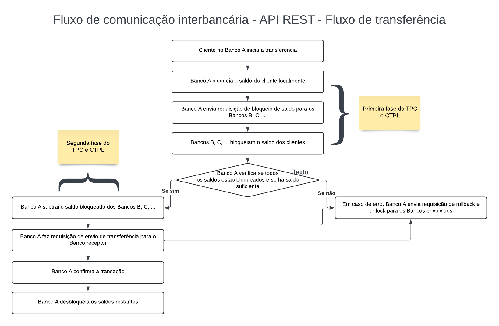
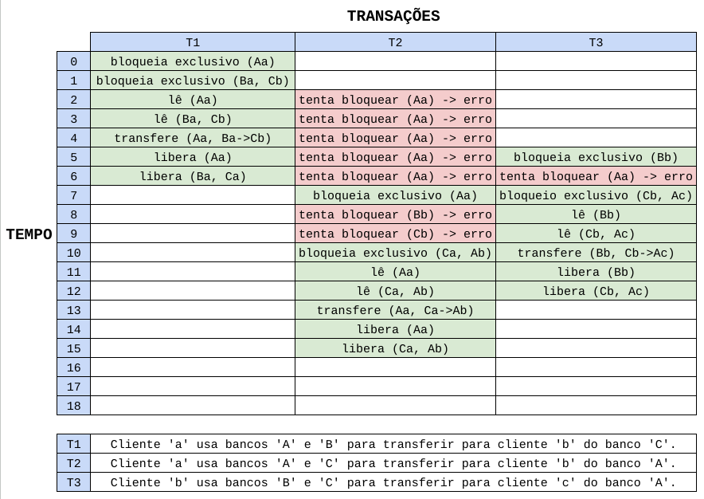
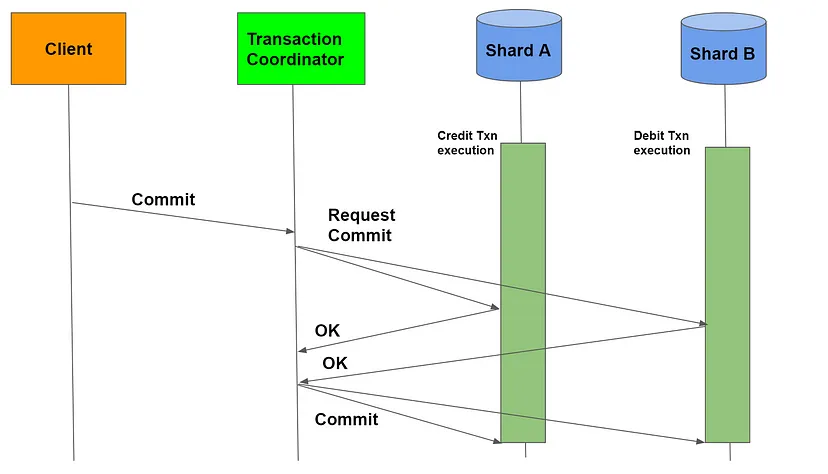
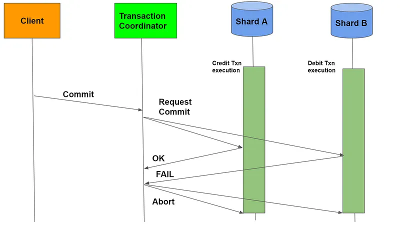

<div align="center">

# Transações Bancárias Distribuidas 🏦

</div>

Este é um sistema para processamento de transações bancárias, utilizando Docker e Docker Compose para configurar e executar três aplicações separadas.

# Resumo

<p align="justify">Este relatório aborda a implementação de um sistema bancário distribuído utilizando o framework Django e o banco de dados PostgreSQL. São executados 3 servidores fixos no docker-compose. O servidor disponibiliza rotas para interface gráfica e para comunicação entre outros servidores. Com a interface gráfica, o usuário consegue efetuar configurações, manipulação de contas e realização de transferências. A comunicação entre servidores acontece para realizar transferência de valores de algum dos bancos do consórcio da conta de um usuário para algum outro banco. Este projeto foi desenvolvido como parte dos estudos da disciplina de Concorrência e Conectividade na Universidade Estadual de Feira de Santana (UEFS).</p>

# Sumário

# Gerenciamento de Contas

## O sistema realiza o gerenciamento de contas? Criar e realizar transações?

<p align="justify">Para o gerenciamento de contas, o sistema utiliza um modelo de usuário personalizado denominado Client, que herda de AbstractBaseUser e PermissionsMixin do Django. Este modelo contém campos essenciais como nome, sobrenome, email, nome de usuário, saldo (balance), saldo bloqueado (blocked_balance), status de transação e status de conta conjunta e campos para identificar usuários da conta conjunta. A criação de novos usuários é gerenciada pelo ClientManager, uma classe personalizada que facilita a criação e configuração de novos objetos de usuário. Este gerenciador assegura que todos os usuários tenham um email único e uma senha segura.</p>

<p align="justify">A autenticação dos usuários é realizada por meio de views dedicadas, como sign_in_page para login, logout_page para logout, e sign_up_page para registro de novos usuários. Durante o processo de login, o sistema valida as credenciais fornecidas pelo usuário e, em caso de sucesso, autentica o usuário e o redireciona para a página de sua conta. Para registro, o sistema coleta as informações necessárias através de um formulário, cria uma nova instância de Client, e a salva no banco de dados.</p>

<p align="justify">A realização de transações é uma das funcionalidades centrais do sistema e é gerenciada por uma combinação de views, formulários e comunicação entre servidores. A view transaction_page é responsável por gerenciar a lógica das transações, permitindo que os usuários realizem transferências, depósitos e pagamentos. Esta view utiliza um formulário (TransactionForm) para capturar os dados da transação, como o valor a ser transferido, o banco destinatário, e o cliente destinatário. Com base na ação selecionada pelo usuário (transferência, depósito ou pagamento), a view executa a lógica apropriada para atualizar os saldos das contas envolvidas.</p>

<p align="justify">Para facilitar a transferência de valores entre diferentes bancos, o sistema utiliza uma função chamada external_client_info, que realiza requisições HTTP para outros servidores bancários, obtendo informações sobre o saldo dos clientes. Esta comunicação entre servidores é essencial para garantir que as transferências interbancárias sejam realizadas de forma eficiente e segura. A view transaction_page também manipula a lógica de retirada de valores de múltiplos bancos, processando uma string de entrada que especifica os valores a serem retirados de cada banco participante.</p>

<p align="justify">Além das operações de transferência, o sistema permite que os usuários realizem depósitos e saques diretamente através da interface gráfica. Para depósitos, o saldo do usuário é incrementado pelo valor especificado, enquanto para saques, o saldo é decrementado. Estas operações são feitas apenas no banco coordenador. Então o usuário "Fulano" só poderá depositar e sacar valores no banco em que ele está manipulando. A comunicação atômica com outros servidores só acontece na transação de transferência, que pode ocorrer através de "n" bancos para algum outro banco.</p>

# Realização de Transferência Entre Diferentes Contas

## É possível transacionar entre diferentes bancos? Por exemplo, enviar do banco A, B e C, para o banco D?

<p align="justify">É possível realizar transações entre diferentes bancos no sistema. Por exemplo, é viável enviar fundos dos bancos A, B e C para o banco D, caso existam 4 bancos registrados no consórcio. O sistema utiliza um protocolo de bloqueio em duas fases (Two-Phase Locking) para garantir a consistência e segurança das transações. Primeiro, os saldos são bloqueados nos bancos de origem (A, B e C) para assegurar que os fundos estão disponíveis. Em seguida, os valores são transferidos para o saldo do cliente no banco destinatário (D). Se ocorrer qualquer falha durante o processo, os saldos bloqueados são revertidos aos seus estados iniciais para manter a integridade das contas.</p>

<p align="justify">Este consórcio é configurado apenas uma vez por meio de uma interface de administração, onde são registrados os nomes, endereços IP e portas dos bancos. Após a configuração inicial, esses bancos são reconhecidos mutuamente, garantindo que as operações subsequentes possam ocorrer de maneira integrada e segura.</p>

<p align="justify">Além disso, também é possível realizar algumas possibilidades de transações:</p>

- <p align="justify">Transações entre constas distintas no mesmo banco: clientes diferentes dentro do mesmo banco (por exemplo, A para A, com diferentes contas de clientes) podem realizar transações entre si, utilizando o mesmo protocolo de bloqueio para assegurar a integridade das transações.</p>

- <p align="justify">Transações multi-origem para um único destino: fundos de múltiplos bancos (por exemplo, B e C) podem ser combinados e transferidos para um único banco de destino (por exemplo, A), quer sejam contas do mesmo cliente ou de diferentes clientes. Isso permite a agregação de fundos de várias fontes em uma única conta.</p>

- <p align="justify">Transações entre diferentes clientes em diferentes bancos: fundos podem ser transferidos de um cliente em um banco de origem (por exemplo, cliente X no banco A) para um cliente diferente em um banco de destino (por exemplo, cliente Y no banco B).</p>

- <p align="justify">Transações entre contas conjuntas: fundos podem ser transferidos de uma conta conjunta de um cliente em um banco de origem para um cliente no mesmo ou em outro banco de destino.</p>

<p align="justify">Essas possibilidades demonstram a flexibilidade do sistema em lidar com uma ampla gama de cenários de transação, garantindo ao mesmo tempo a segurança e a integridade dos dados através do uso do protocolo de bloqueio em duas fases.</p>

# Comunicação Entre Servidores

## Os bancos estão se comunicando com o protocolo adequado?

<p align="justify">No sistema, os bancos estão utilizando um protocolo personalizado baseado em requisições HTTP para comunicação entre si: API REST. A comunicação é feita baseada no formato JSON. Especificamente, o sistema utiliza uma abordagem de transações distribuídas inspirada no conceito de Two-Phase Commit (2PC) e Conservative Two-Phase Locking (CTPL), adaptada para ambientes distribuídos e multi-banco. </p>

<p align="center">
  
  Figura 1. Comunicação Interbancária usando API REST: métodos HTTP e estados. 
</p>

<p align="justify">A API REST permite que os bancos enviem e recebam requisições HTTP, garantindo uma comunicação padronizada e eficiente. O protocolo 2PC é implementado para assegurar a consistência e a atomicidade das transações, realizando operações em duas fases: prepare e commit. </p>

<p align="justify">Na fase prepare, os bancos envolvidos verificam se podem concluir a transação, bloqueando os recursos necessários; na fase commit, a transação é confirmada e os recursos são efetivamente transferidos. Se houver algum problema na transação em algum dos passos, todos os bancos são abortados da operação.</p> 

<p align="center">
  
  Figura 2. Comunicação Interbancária usando API REST. 
</p>

<p align="justify">O CTPL é utilizado para gerenciar os bloqueios dos recursos, evitando conflitos e garantindo que as operações sejam realizadas de forma segura e ordenada. A implementação dessas técnicas está baseada nas funções de bloqueio e desbloqueio de contas, verificação de saldos e coordenadação de transferência de fundos entre os bancos, assegurando a integridade e a segurança das transações distribuídas.</p>

# Sincronização em um Único Servidor

## Como tratou a concorrência em um único servidor, quando chegam mais de um pedido de transação a um único servidor?

<p align="justify">A sincronização de transações em um único servidor que atende múltiplos pedidos simultâneos é um desafio crítico em sistemas de bancos de dados. No contexto do problema fornecido, a concorrência foi tratada utilizando-se várias técnicas, principalmente as transações atômicas e o bloqueio de registros, para assegurar a consistência e a integridade dos dados.</p>

<p align="justify">Com a transação atômica implementada, há a garantia que o bloco de código dentro da transação seja executado completamente ou não seja executado de forma alguma. Em caso de falha em qualquer ponto dentro da transação, todas as operações realizadas até aquele ponto são revertidas, garantindo assim a atomicidade da transação. Não apenas no banco coordenador, mas também nos bancos que fazem parte da transação. Além disso, o método select_for_update() é usado para bloquear os registros de clientes enquanto a transação está em andamento. Este bloqueio impede que outros processos modifiquem esses registros até que a transação seja concluída, prevenindo condições de corrida.</p>

<p align="justify">No caso de um único servidor, é possível que clientes diferentes efetuem transações no mesmo instante. O servidor Django utilizado permite o acesso assíncrono de requisições. Para isso, é necessário que os clientes se autentiquem e realizem as transações. </p>

<p align="justify">Por outro lado, se em uma única conta há tentativa de mais de duas transações ao mesmo tempo, alguma das transações é bloqueada. Isso acontece comumente em contas conjuntas, quando algum cliente A tenta efetuar uma transação com a conta AB e o cliente B também, no mesmo instante. Quando isso ocorre, uma das transações é bloqueada devido ao bloqueio iniciado pela primeira transação. Para isso, é utilizado uma memória cache. A função lock_this_account() lê e escreve estados de transação no cache, permitindo uma verificação rápida do estado da transação de um cliente. Isso reduz a necessidade de operações de banco de dados frequentes, melhorando a performance em cenários de alta concorrência.</p>

<p align="justify">No contexto das operações de bloqueio e desbloqueio de saldos de clientes, o código assegura que apenas um processo possa modificar o saldo bloqueado de um cliente por vez. O método realize_lock() verifica se o cliente já está envolvido em outra transação (in_transaction). Se estiver, a operação é abortada. Caso contrário, o saldo do cliente é bloqueado (transferido para blocked_balance), e o campo in_transaction é marcado como True, sinalizando que uma transação está em andamento. Esse mecanismo evita que múltiplas transações concorrentes alterem o saldo do cliente simultaneamente.</p>

<p align="justify">A implementação das operações de transferência entre bancos (na função transfer()) ilustra um protocolo de bloqueio em duas fases (Two-Phase Locking - 2PL), a ser detalhado no próximo tópico. Primeiro, todas as contas envolvidas são bloqueadas para evitar condições de corrida, e somente após garantir que todas as contas foram corretamente bloqueadas é que a transferência é realizada. Caso ocorra qualquer falha durante o processo de bloqueio, todos os bloqueios são revertidos (rollback), garantindo que o sistema permaneça em um estado consistente.</p>

# Algoritmo da Concorrência Distribuída

## O algoritmo da concorrência distribuída está teoricamente bem empregado? Qual algoritmo foi utilizado? Está correto para a solução?

<p align="justify">Em sistemas distribuídos, a concorrência é essencial para permitir que múltiplas transações sejam processadas simultaneamente. No entanto, isso pode levar a conflitos, inconsistências e problemas como deadlocks (onde duas ou mais transações esperam indefinidamente por recursos bloqueados entre si). Para essas situações, há a necessidade de um protocolo que possa gerenciar a concorrência garantindo a serializabilidade dos conflitos (evitando que transações interfiram entre si de maneiras que resultem em inconsistências) e prevenindo deadlocks.</p>

<p align="justify">Um protocolo que resolve o problema do deadlock é uma variação do Two-Phase Locking: conservative. Na sua primeira fase, antes de executar qualquer operação (leitura ou escrita), uma transação deve solicitar e adquirir todos os bloqueios de que necessitará durante sua execução. Na segunda fase, após adquirir todos os bloqueios necessários, a transação pode começar a liberar bloqueios, mas não pode solicitar novos bloqueios.</p>

Vantagens:
- Sem Deadlocks: Como todas as transações adquirem todos os bloqueios necessários antecipadamente, elimina-se a possibilidade de deadlocks.

Desvantagens:
- Menor Concorrência: A exigência de adquirir todos os bloqueios antecipadamente pode levar a um menor grau de concorrência.
- Necessidade de Conhecimento Antecipado: As transações precisam saber de antemão todos os recursos de que precisarão, o que pode ser impraticável em alguns cenários.

<p align="justify">Como, no nosso caso, os bancos registrados poderiam ser fixos para o consórcio, o conhecimento antecipado dos bancos foi algo simples de ser implementado, o que mitigou a desvantagem do uso desse algoritmo. Com isso, nesse projeto, foi utilizado o Conservative Two-Phase Locking, com alguns acréscimos para solução completa do problema proposto.</p>

<p align="center">
  
  Figura 3. Conservative Two-Phase Locking Example. 
</p>

<p align="justify">Outro algoritmo principal utilizado para solucionar as transações atômicas foi o Two-Phase Commit. Esse protocolo opera em dois estágios distintos: a fase de preparação (prepare phase) e a fase de commit (commit phase), podendo se estender para a fase de cancelamento (rollback phase). Na fase de preparação, o coordenador de transação envia uma mensagem de "prepare" para todos os participantes, solicitando que se preparem para commit a transação. Cada participante então responde com uma mensagem de "commit" se estiver pronto para commit (Figura 3), ou "abort" se encontrar algum problema que impeça o commit (Figura 4). Esta fase assegura que todos os participantes concordem em prosseguir ou abortar a transação. Caso algum participante vote em abortar, todos os processos até este momento são desfeitos e todos os bancos são desbloqueados, prevenindo inconsistências entre os bancos de dados envolvidos. </p>

<p align="justify">Então, o algoritmo de Two-Phase Locking (2PL) conservador é um método utilizado para controlar o acesso concorrente aos recursos em um sistema distribuído, garantindo que todas as operações que necessitam de bloqueios sejam obtidas antes do início da execução da transação. Este algoritmo é projetado para evitar deadlocks ao garantir que nenhuma transação comece até que todos os bloqueios necessários estejam garantidos. Já o Two-Phase Commit (2PC) é um protocolo utilizado para garantir a atomicidade das transações distribuídas, coordenando o compromisso de uma transação entre todos os participantes para garantir que ou todos os participantes confirmem a transação ou todos façam o rollback.</p>

<p align="center">
  
  Figura 4. Two-Phase Commit - Commit State. 
</p>

<p align="center">
  
  Figura 5. Two-Phase Commit - Abort State. 
</p>

Com base nas instruções passadas e no problema a ser resolvido, a junção dos algoritmos acima, com algumas modificações acrescidas, solucionaram o problema.

## Algoritmo está tratrando o problema na prática? A implementação do algoritmo está funcionamento corretamente?

<p align="justify">A arquitetura do sistema emprega um modelo de bloqueio de saldo, onde valores são temporariamente bloqueados nas contas dos clientes para assegurar a consistência das transações. Quando um banco recebe uma requisição de bloqueio, ele verifica se o cliente está atualmente em uma transação. Caso não esteja, o saldo do cliente é transferido para um saldo bloqueado, impedindo outras operações até a conclusão da transação. Esse método garante que os fundos necessários para a transação estejam disponíveis e reservados.</p>

<p align="justify">Para realizar uma transação, o sistema segue um protocolo de Two-Phase Locking (2PL). Primeiro, o saldo é bloqueado em todos os bancos de onde os fundos serão retirados. Se qualquer banco falhar em bloquear o saldo necessário, a operação é abortada e os saldos previamente bloqueados são desbloqueados. Isso evita inconsistências caso algum banco não consiga participar da transação.</p>

<p align="justify">Uma vez que todos os saldos são bloqueados com sucesso, inicia-se o processo de transferência. O banco destinatário recebe uma requisição para confirmar a transação, momento em que os valores são efetivamente transferidos dos saldos bloqueados dos bancos de origem para o saldo do cliente no banco destinatário. Se o banco destinatário não puder concluir a transação, um procedimento de rollback é iniciado, retornando os valores aos saldos originais nos bancos de origem.</p>

<p align="justify">Durante todo o processo, diversas medidas de segurança são implementadas para garantir a atomicidade e consistência da transação. Em caso de falhas de comunicação, como tempos de espera excedidos (timeouts), o sistema tenta reverter as operações para o estado inicial, desbloqueando os saldos bloqueados e assegurando que nenhuma transação parcial ocorra.</p>

<p align="justify">A coordenação dessas operações é gerenciada por funções específicas que realizam bloqueios, verificações de saldo e atualizações das contas dos clientes. A função lock_all_banks é responsável por enviar requisições de bloqueio para todos os bancos envolvidos, enquanto verify_balance_otherbanks assegura que os saldos bloqueados são suficientes para a transação. Caso algum banco reporte um saldo insuficiente, a operação é abortada antes de qualquer alteração permanente nas contas.</p>

<p align="justify">Ao final da transação, se todos os passos forem concluídos com sucesso, os valores são efetivamente subtraídos dos saldos bloqueados dos bancos de origem e adicionados ao saldo do cliente no banco destinatário. Em caso de falhas, as funções de rollback garantem que todos os valores sejam restaurados aos seus estados originais, preservando a integridade do sistema.</p>

<p align="justify">Essas técnicas combinadas - transações atômicas, bloqueio de registros, verificação de estado via cache, e o protocolo de bloqueio em duas fases - constituem uma abordagem robusta para lidar com concorrência em sistemas distribuídos, permitindo que o sistema elaborado trate o problema na prática e funcione de acordo com o esperado. As técnicas asseguram que as transações sejam executadas de forma segura e consistente, mesmo em cenários de alta concorrência, minimizando o risco de inconsistências e garantindo a integridade dos dados dos clientes, que são fatores importantes na implementação de um sistema bancário.</p>

# Tratamento da Confiabilidade

## Quando um dos bancos perde a conexão, o sistema continua funcionando corretamente? E quando o banco retorna à conexão?

<p align="justify">Na situação de instabilidade nos bancos, existem duas possibilidades abordadas quando o sistema está em execução: o banco ser desconectado e conectado antes ou depois de alguma transação e durante uma transação.</p>

<p align="justify">Quando o banco é desconectado ou conectado antes ou depois de uma transação, o servidor coordenador verifica antes de fazer uma transação se o servidor (banco) está escutando. Se ele não tiver escutando quando um usuário tentar usar essa conta nesse banco, indisponível neste instante, será retornado que o banco está inativo. Quando o banco volta, é atualizado na interface e o usuário consegue novamente utilizá-lo para as transações.</p>

<p align="justify">A outra situação é o banco cair durante uma transação. Quando isso ocorre, o servidor que caiu não responde uma das etapas, como a confirmação de commit, por exemplo. Nesse instante, a operação é abortada e todo o processo é desfeito, como o retorno para os saldos iniciais em todas as contas e desbloqueio de todos os bancos. Isso ocorre em qualquer etapa de algum dos algoritmos (Conservative Two-Phase Locking ou Two-Phase Commit) até que todos os bancos tenham confirmado o recebimento do valor. Se existir uma situação que, após o rollback, esse banco ainda não responder, o banco coordenador será avisado sobre essa situação, apresetando o erro para o usuário. Quando esse banco voltar, ele poderá fazer conexão com todos os outros bancos novamente.</p>

<p align="justify">Para que o valores monetários não sumissem ou fossem duplicados, foi utilizado uma estratégia de estados para o saldo, durante as fases dos dois algoritmos citados acima.</p>

### 1° Fase - Two Phase Locking (lock):

- Saldo (balance) -> Saldo Bloqueado (blocked_balance) - Em transação (in_transaction).

### 1° Fase - Two Phase Commit (init/prepare):

- Saldo Bloqueado (blocked_balance) - Em transação (in_transaction).
- Valor é acrescido ao blocked_balance do cliente do banco receptor.
- Valor é subtraído dos blocked_balance das contas do cliente fornecedor.

### 2° Fase - Two Phase Commit (commit):

- Saldo Bloqueado (blocked_balance) - Em transação (in_transaction) -> Saldo (balance).
- Valor é desbloqueado da conta do banco receptor.

### 3° Fase - Two Phase Commit (rollback):

- Saldo Bloqueado (blocked_balance) - Em transação (in_transaction).
- Valor é descrescido do valor bloqueado da conta do banco receptor.
- Saldo Bloqueado (blocked_balance) - Em transação (in_transaction) -> Saldo (balance).

### 2° Fase - Two Phase Locking (unlock):

- Saldo Bloqueado (blocked_balance) - Em transação (in_transaction) -> Saldo (balance).
- Valor é desbloqueado das contas dos bancos fornecedores.

Isso garante que se houver algum erro até a fase de desbloqueio, o saldo possivelmente com divergência estará bloqueado e não disponível para transferências ou saque.

# Transação Concorrente

# Conclusão

# Configuração Inicial do Uso do Docker

## Clonando o Repositório

```bash
git clone https://github.com/douglasojesus/bank-transactions.git
cd bank-transactions/
```

## Construindo os contêineres:
```bash
docker-compose build
```

## Executando o sistema:
```bash
docker-compose -p projeto up
```
Isso iniciará todos os contêineres necessários para os aplicativos.

## Configuração dos Bancos de Dados

Para configurar os bancos de dados, você precisará dos IPs dos contêineres. Você pode encontrá-los usando o comando `docker ps` e, em seguida, inspecionando cada contêiner conforme mostrado abaixo:

## Obtenção dos IPs dos Contêineres

```bash
sudo docker inspect -f '{{range .NetworkSettings.Networks}}{{.IPAddress}}{{end}}' bank-transactions-app1-1
sudo docker inspect -f '{{range .NetworkSettings.Networks}}{{.IPAddress}}{{end}}' bank-transactions-app2-1
sudo docker inspect -f '{{range .NetworkSettings.Networks}}{{.IPAddress}}{{end}}' bank-transactions-app3-1
```

## Acesso aos Servidores
Acesse cada servidor utilizando o IP correspondente para configurar os bancos de dados conforme necessário.

## Testes Automatizados
Você pode usar o arquivo teste_automatizado/main.py para automatizar o acesso às URLs dos contêineres e testar o sistema.
```bash
cd teste_automatizado/main.py
sudo python3 main.py
```

### Teste de 'stop' e 'start' de um dos servidores

Para encerrar algum container basta usar o comando:
```bash
docker stop container_id
```
Para fazer o servidor retornar:
```bash
docker start container_id
```
Para verificar o 'container_id':
```bash
docker ps -a
```

## Conceitos a serem abordados

Conservative Two-Phase Locking (C2PL)

O Conservative Two-Phase Locking é um protocolo de controle de concorrência que requer que uma transação adquira todos os bloqueios necessários antes de iniciar sua execução. Ele difere do Two-Phase Locking (2PL) no sentido de que todos os bloqueios são obtidos antes de qualquer operação de leitura ou escrita ocorrer.

Fase de Bloqueio Completo: Antes de iniciar a execução, a transação adquire todos os bloqueios necessários. Nenhum item é bloqueado até que todos os itens estejam prontos para serem bloqueados, evitando assim que um item não bloqueável cause a espera (Hold and Wait).

Eliminação de Deadlock: Se um item não estiver disponível para bloqueio, todos os bloqueios são liberados e a transação tenta novamente mais tarde, sem manter bloqueios enquanto espera.

Two-Phase Locking (2PL)
O Two-Phase Locking é um protocolo de controle de concorrência amplamente utilizado em produtos de banco de dados comerciais. Ele divide a execução de uma transação em duas fases distintas:

Fase de Crescimento (Growing Phase): Durante esta fase, a transação adquire sequencialmente todos os bloqueios necessários para os itens de dados que irá acessar. Nenhum bloqueio é liberado durante esta fase.

Fase de Redução (Shrinking Phase): Inicia-se quando o primeiro bloqueio é liberado. Nesta fase, a transação começa a liberar os bloqueios, um após o outro, e não adquire nenhum novo bloqueio.

Propriedade Adicional: Todas as histórias que resultam do uso do 2PL têm a propriedade adicional de que as operações de bloqueio são ordenadas para cumprir a separação em duas fases.

Para mais detalhes sobre o Two-Phase Locking, consulte este documento.

Essas estratégias são essenciais para garantir a consistência e a integridade dos dados em ambientes de banco de dados multiusuário, prevenindo impasses (deadlocks) e conflitos de acesso simultâneo aos dados.

Bibliografia:
https://www.imperial.ac.uk/media/imperial-college/faculty-of-engineering/computing/public/1617-ug-projects/David-Pollak---Reasoning-about-Two-phase-Locking-Concurrency-Control.pdf
https://www.naukri.com/code360/library/conservative-2-phase-locking

## Gerenciamento do saldo:

São usados dois algoritmos: o two-phase commit e o two-phase locking. Cada um tem 2 fases.

