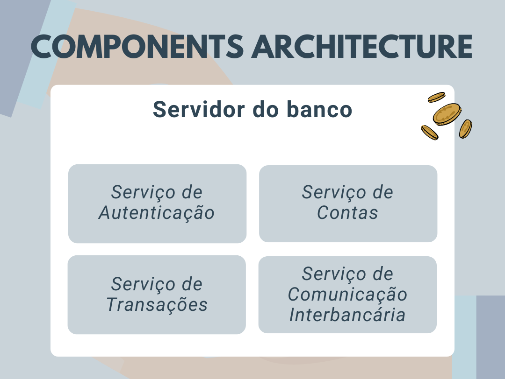

# Transações Bancárias Distribuidas 🏦

# Resumo

Este relatório aborda a implementação de um sistema distribuido que interconecta aplicações (bancos financeiros) para realizar criação de contas bancárias e gerenciar transações financeiras, semelhante ao modo de transferência do Pix. Os clientes, a partir de qualquer banco, podem realizar transações atômicas sobre o dinheiro em contas de outro banco, inclusive envolvendo mais de duas contas. A comunicação entre os servidores dos bancos deve ser implementada através de um protocolo baseado em uma API REST. Este projeto foi desenvolvido como parte dos estudos da disciplina de Concorrência e Conectividade na Universidade Estadual de Feira de Santana (UEFS).

# Objetivo

Desenvolver um sistema de transações bancárias distribuídas que permita a criação de contas bancárias e a realização de pagamentos, depósitos e transferências entre contas de diferentes bancos, em um país sem banco central. O sistema deve garantir a integridade das transações e evitar o duplo gasto.

# Natureza do Sistema

- Distribuído: O sistema deve operar sem um ponto central de controle, distribuindo as responsabilidades entre os diferentes bancos participantes.
- Atômico: As transações devem ser atômicas, garantindo que todas as operações de uma transação sejam concluídas com sucesso ou nenhuma seja aplicada, mantendo a consistência dos dados.

# Componentes Principais

- Contas Bancárias: O sistema deve suportar a criação e gerenciamento de contas bancárias, incluindo contas físicas, particulares, conjuntas e de pessoas jurídicas.
- Transações: O sistema deve permitir transações como pagamentos, depósitos e transferências, inclusive entre contas de diferentes bancos.

# Comunicação e Integração

- API REST: A comunicação entre os servidores dos bancos deve ser feita através de um protocolo baseado em API REST, facilitando a integração e evitando problemas de bloqueio por firewalls das instituições.
- Contêineres Docker: A solução deve ser desenvolvida utilizando contêineres Docker, permitindo uma fácil implantação e escalabilidade do sistema.
- Frameworks de Terceiros: É permitido o uso de frameworks de terceiros para a implementação das interfaces web e APIs dos servidores, desde que a comunicação interbancária siga o protocolo REST definido.

# Requisitos Funcionais
- Criação de Contas: Permitir a criação de novas contas bancárias de diferentes tipos.
- Realização de Transações: Permitir que os clientes realizem transações financeiras, garantindo a integridade e segurança das mesmas.
- Consistência de Dados: Garantir que as contas não movimentem mais dinheiro do que possuem e evitar o duplo gasto.

# Desafios e Considerações:
- Coordenação Distribuída: Sem um banco central, a coordenação das transações deve ser feita de maneira distribuída, o que exige mecanismos robustos de consenso e coordenação.
- Integridade das Transações: Implementar mecanismos que garantam que uma mesma quantia de dinheiro não seja gasta mais de uma vez (prevenção de duplo gasto).
- Compatibilidade e Interoperabilidade: Garantir que diferentes bancos, possivelmente utilizando sistemas heterogêneos, possam se comunicar e realizar transações de forma eficaz.
- Monitoramento e Manutenção: Implementar sistemas de monitoramento e manutenção para garantir a operação contínua e eficiente do sistema.

# Componentes da Arquitetura:

  

